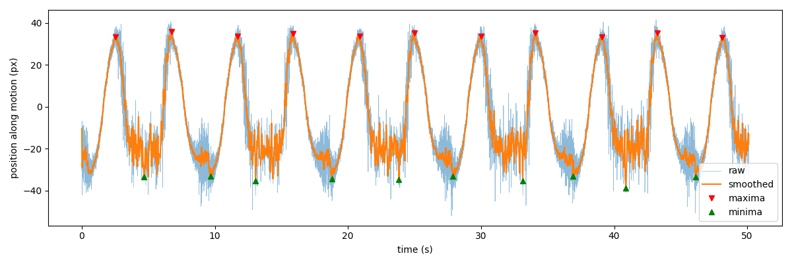
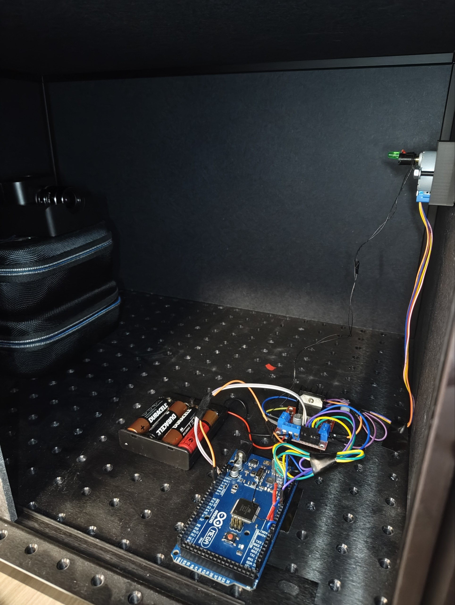
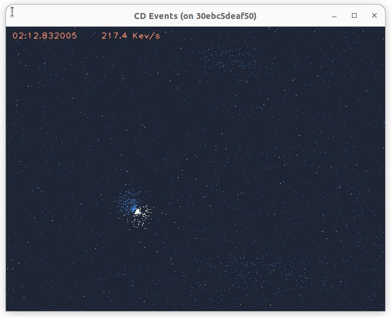
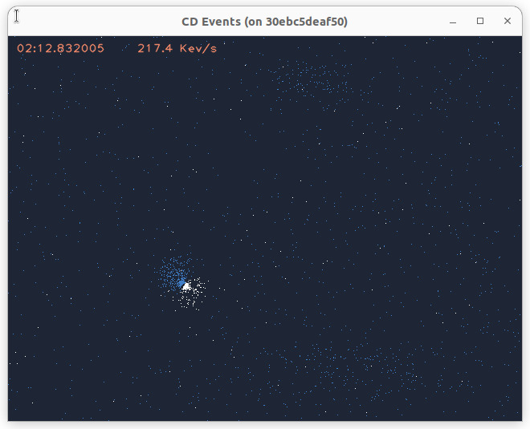

# Prophesee EVK1 event camera on Ubuntu 22.04 (via Docker) + LED swing-frequency measurement

Getting raw events out of an old Prophesee **EVK1** camera on a modern Ubuntu host, and using them to
measure the back-and-forth frequency of an LED moved by a stepper motor in a dark box.



## Setup (hardware)

<!-- Replace with your own photos/video. Put the files in docs/media/ -->


Video of the setup: https://drive.google.com/file/d/1er5t7W3byAH9WIZbHrR9HpN8V-1-_d6h/view?usp=sharing

- Camera: Prophesee EVK1 (USB ID `04b4:00f4`, detected by OpenEB as `hal_plugin_gen31_fx3`, sensor 640x480)
- LED on a stepper-driven arm, swinging side to side in front of the camera in a dark box
- Host: Ubuntu 22.04, Docker

## Why Docker, and why OpenEB 3.1.2

Prophesee's FAQ states that EVK1 cameras are not supported from SDK 4.0.0 onward (latest compatible: 3.1),
and the Metavision Studio installers are no longer freely downloadable. The open-source **OpenEB 3.1.2**
(built from source, no login needed) recognizes this camera and records RAW files. It builds cleanly on Ubuntu 20.04,
so it runs in a container while the host stays on 22.04.

## 1. Build the container

```bash
cd docker
sudo docker build -t evk1:3.1.2 .
```

The Dockerfile reproduces the manual steps that worked for the author; it takes a while to compile OpenEB.

## 2. Start it

```bash
./docker/run.sh            # shares ~/evk1_data with the container as /data
```

Check that the camera is seen:

```bash
metavision_hal_ls          # expected: Device detected: Prophesee:hal_plugin_gen31_fx3:<serial>
```


## 3. Record events

```bash
metavision_viewer -o /data/rec1
```

Click the window, press **SPACE** to start recording, **SPACE** again to stop, **q** to quit (not Ctrl+C).
Always give an output name inside `/data`, otherwise the file lands inside the container
(for example `-o /data` created `/data.raw`).

Convert to readable events. The converter has no output option and writes `cd.csv` into the current folder:

```bash
cd /data
metavision_raw_to_csv -i /data/rec1.raw
mv cd.csv rec1.csv
```

Each CSV line is one event: `x, y, polarity, timestamp_us`.
Files created in the container are owned by root; fix it on the host with `sudo chown -R $USER:$USER ~/evk1_data`.

## 4. Analyse (on the host, not in the container)

```bash
pip3 install -r requirements.txt
python3 scripts/diag_clean.py ~/evk1_data/rec1.csv          # hot pixels, noisy regions, periodic flicker
python3 scripts/swing_count.py ~/evk1_data/rec1.csv --roi X0 X1 Y0 Y1
```

`swing_count.py` takes a box (`--roi`) around the LED's path, follows the mean event position over time,
smooths it, finds the peaks and prints cycle count, period and FFT frequency. It saves a graph next to the CSV.

## Results

In a ~50 s recording the script counted **11 back-and-forth cycles**; the FFT gives **0.219 Hz** (about 4.6 s per cycle),
which matches the spacing of the first and last peak. Peak spacing alternates slightly (about 4.1 and 5.0 s),
so the outward and return motions are not identical.
The flat noisy bottom of each wave is probably the LED leaving the analysed box or getting dim; count the maxima, not the minima.
This was not yet checked against an independent reference (stopwatch or motor settings).




## Not included

Recordings (`*.raw`, `*.csv`) are large and git-ignored. Attach them to a GitHub Release if you want to share them.
OpenEB itself is not included; the Dockerfile clones it from <https://github.com/prophesee-ai/openeb> (Apache-2.0).
